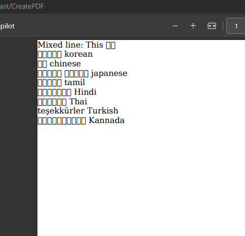

# Devanagari Font Support on Linux

This document provides instructions on how to install the necessary fonts to support Devanagari script on a Linux system.

## Prerequisites

Ensure that you have `sudo` or root access to your Linux system.

## Installation Steps

1. Install the `fonts-indic` package. This package contains a collection of free fonts for the Indic scripts of the Indian subcontinent.

    ```bash
    sudo apt-get -y install fonts-indic
    ```

2. Install the `fonts-noto` package. Noto fonts aim to support all languages with a harmonious look and feel.

    ```bash
    sudo apt -y install fonts-noto
    ```

## Additional Resources

For more information on adding Hindi fonts to Ubuntu font family, visit [this link](https://askubuntu.com/questions/447050/adding-hindi-fonts-to-ubuntu-font-family).

For more details on the `fonts-noto` package, visit [this link](https://howtoinstall.co/package/fonts-noto).

## Result

After following the above steps, Devanagari script should be supported on your Linux system. Here is a screenshot of a PDF generated with Devanagari script:

